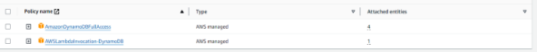

**T.C.** 

**TEKİRDAĞ NAMIK KEMAL ÜNİVERSİTESİ ÇORLU MÜHENDİSLİK FAKÜLTESİ 
BİLGİSAYAR MÜHENDİSLİĞİ BÖLÜMÜ** 

**ARAÇ TAKİP SİSTEMİ** 

**LİSANS BİTİRME PROJESİ ARA RAPORU** 

**Hazırlayanlar 
1190606058 Ahmet Furkan UGAR 1200606002 Başak Nisan İVGEN 1200606050 Burak İlkaan ALİM 1200606027 Mustafa ÇELİK** 

**Danışman** 

**Dr. Öğr. Üyesi Halil Nusret BULUŞ Dr. Öğr. Üyesi Erkan ÖZHAN** 

**Ocak, 2024** 

**Çorlu Mühendislik Fakültesi** 

**ARAÇ TAKİP SİSTEMİ** 

**Tekirdağ Namık Kemal Üniversitesi Çorlu Mühendislik Fakültesi** 
**Bilgisayar Mühendisliği Bölümü**      **Lisans Bitirme Projesi** 

**Bitirme Projesinin Savunulduğu Tarih: 26/01/2024** 

**Ahmet Furkan UGAR 1190606058 Başak Nisan İVGEN 1200606002**  

**Burak İlkaan ALİM 1200606050 Mustafa ÇELİK 1200606027** 

**Danışmanlar:  Dr. Öğr. Üyesi Halil Nusret BULUŞ, Dr. Öğr. Üyesi Erkan ÖZHAN** 

**Ocak, 2024** 

**Çorlu Mühendislik Fakültesi** 

**LİSANS BİTİRME PROJESİ BEYANNAMESİ** 

“Araç  Takip  Sistemi”  başlıklı  bu  lisans  bitirme  projesi  ara  raporunun  tasarımı, hazırlanması, yürütülmesi, araştırmaların yapılması aşamalarında danışmanlarımız Dr. Öğr. Üyesi Halil Nusret BULUŞ ve Dr. Öğr. Üyesi Erkan ÖZHAN kontrolünde bilimsel etik ve akademik  kurallara  özen  göstererek  çalıştığımızı;  başka  kaynaklardan  aldığımız  verileri, bulguları ve materyalleri bilimsel etiğe uygun olarak metinde ve kaynakçada eksiksiz olarak gösterdiğimizi ve aksinin ortaya çıkması durumunda her türlü yasal sonucu kabul ettiğimizi beyan ederiz. 

26/01/2024 

Ahmet Furkan          Başak Nisan       UGAR             İVGEN  

Burak İlkaan               Mustafa                 ALİM                       ÇELİK 

**TEŞEKKÜR** 

Lisans bitirme projesi raporunun hazırlanmasında katkıda bulunan doğrudan yetkili Dr. Öğr. Üyesi Halil Nusret BULUŞ ve Dr. Öğr. Üyesi Erkan ÖZHAN’a; doğrudan yetkili ve ilgili olmadığı halde olağan görevi dışında katkıda bulunmuş CIO Çağlar AKSU’ya (Sensemore Teknoloji  A.Ş.)  ve  CTO  Ozan  ERTÜRK’e  (Sensemore  Teknoloji  A.Ş.)  teşekkürlerimizi sunarız. 

26/01/2024 Ahmet Furkan UGAR Başak Nisan İVGEN Burak İlkaan ALİM Mustafa ÇELİK 

**İÇİNDEKİLER** 

**Sayfa** 

**LİSANS BİTİRME PROJESİ BEYANNAMESİ .................................................................iii** **TEŞEKKÜR ............................................................................................................................. iv** **İÇİNDEKİLER ......................................................................................................................... v** **ŞEKİL LİSTESİ ....................................................................................................................viii** **TABLO LİSTESİ ..................................................................................................................... ix** **SEMBOL LİSTESİ .................................................................................................................. x** **KISALTMA LİSTESİ ............................................................................................................. xi** **ÖZET ......................................................................................................................................xiii** **ABSTRACT ........................................................................................................................... xiv** 

1. **ARAÇ TAKİP SİSTEMİ PROJESİNE GENEL BAKIŞ .............................................. 1** 
1. **BULUT (CLOUD) UYGULAMASI ................................................................................ 2** 
1. *AWS (Amazon Web Services – Amazon Ağ Servisleri) .................................................... 2* 
1. *IoT Core Servisi .............................................................................................................. 3* 
1. Thing Cihazının Oluşturulması ................................................................................. 3 
1. Thing Cihazına Gerekli Policy’lerin Atanması ......................................................... 5 
3. MQTT Brokerdan Veri Paylaşımı ............................................................................. 5 
3. *IAM Servisi....................................................................................................................... 5* 

2\.3.1. IAM Servisi Üzerinden Kullanıcı Oluşturma............................................................ 6 

4. *DynamoDB Servisi ........................................................................................................... 6* 

2\.4.1. Database Kurulumu ................................................................................................... 7 

5. *Lambda Servisi................................................................................................................. 8* 
1. Lambda Fonksiyonu Oluşturma ................................................................................ 8 
1. Lambda Servisi Pyhton Scripti .................................................................................. 8 
6. *Rest API ........................................................................................................................... 9* 
3. **GÖMÜLÜ SİSTEM UYGULAMASI............................................................................ 10** 
1. *Elektronik Devre ve Prototip ......................................................................................... 10* 
1. *Gömülü Sistem Uygulamasında Kullanılan ve Kullanılacak Teknolojiler .................... 11* 
1. *Gömülü Sistem Uygulamasının Genel Akışı .................................................................. 13* 
1. *Gömülü Sistem Uygulamasında Yapılan Geliştirmeler ................................................. 16* 
1. MORO\_COMMON Kütüphanesi ........................................................................... 16 
1. MORO\_MQTT Kütüphanesi .................................................................................. 19 
1. MORO\_SIM800L Kütüphanesi .............................................................................. 22 
4. MORO\_WEBSERVER Kütüphanesi ..................................................................... 24 
4. **WEB UYGULAMASI ..................................................................................................... 26** 
1. *Web Uygulamasında Kullanılan ve Kullanılacak Teknolojiler ..................................... 26* 
1. *Web Uygulaması Genel Akışı......................................................................................... 28* 
1. *Web Uygulamasında Yapılan Geliştirmeler .................................................................. 31* 
1. Sunucu ve Arka Plan Servislerinin Entegrasyonu................................................... 31 
1. Razor Kodlarının İşlenmesi ve Asenkron Servisler ................................................ 31 
1. MQTT Broker Bağlantısı ve Mesaj Ayırma Servisi ............................................... 31 
1. SignalR İletişim Servisi ........................................................................................... 31 
1. Client Tarafındaki Geliştirmeler ............................................................................. 31 
4. *Gelecek Planlaması ve Yapılacak Geliştirmeler............................................................ 32* 
1. Sunucu Tarafı Optimizasyonları ............................................................................. 32 
1. Kullanıcı Arayüzü Geliştirmeleri ............................................................................ 32 
1. Geçmiş Konum Verileri Özelliği ............................................................................ 33 
2. **KAYNAKLAR ................................................................................................................. 34** 
3. **EKLER ............................................................................................................................. 35** **ÖZGEÇMİŞ - 1 ....................................................................................................................... 36** **ÖZGEÇMİŞ - 2 ....................................................................................................................... 37** **ÖZGEÇMİŞ - 3 ....................................................................................................................... 38** **ÖZGEÇMİŞ - 4 ....................................................................................................................... 39** 

**ŞEKİL LİSTESİ** 

**Sayfa** 

**Şekil 2.1.** Bulut (cloud) uygulamasının akış şeması .................................................................. 2 **Şekil 2.2.** Elde edilen sertifikalar ............................................................................................... 4 **Şekil 2.3.** Gerekli politikalar ...................................................................................................... 5 **Şekil 2.4.** IAM servisi izinleri .................................................................................................... 6 **Şekil 2.5.** Database Kurulumu .................................................................................................... 7 **Şekil 2.6.** Lambda fonksiyonunun Iot Core’a bağlanması ......................................................... 8 **Şekil 3.1.** Araç takip sistemi devre şematiği ............................................................................ 11 **Şekil 3.2** Gömülü sistem yazılımının akış diyagramı............................................................... 15 **Şekil 3.3.** MORO\_COMMON kütüphanesinin başlık dosyası içeriği ..................................... 17 **Şekil 3.4.** MORO\_MQTT kütüphanesinin başlık dosyası içeriği ............................................ 20 **Şekil 3.5.** MORO\_SIM800L kütüphanesinin başlık dosyası içeriği ........................................ 22 **Şekil 3.6.** MORO\_WEBSERVER kütüphanesinin başlık dosyası içeriği ............................... 24 **Şekil 4.1.** Asenkron metod örneği ............................................................................................ 29 **Şekil 4.2.** Web uygulaması akış diyagramı .............................................................................. 30 

**TABLO LİSTESİ** 

**Sayfa** 

**Tablo 2.1.** Sertifika kullanım alanları ........................................................................................ 4 **Tablo 3.1.** Elektronik devreye ait komponent listesi ............................................................... 10 

**Tablo 3.2.** Gömülü sistem uygulamasında kullanılan ve kullanılacak teknolojiler ve kullanım amaçları .................................................................................................................................... 12 

**Tablo 4.1.** Web uygulamasında kullanılan ve kullanılacak teknolojiler ve kullanım amaçları

.................................................................................................................................................. 26 

**SEMBOL LİSTESİ** 

**cm**  : Santimetre 

**mm**  : Milimetre 

**V**  : Volt 

**ms**  : Milisaniye 

**Vcc** : Common Collector Voltage (Genel Toplayıcı Voltaj) 

**KISALTMA LİSTESİ** 

**MQTT** : Message Queuing Telemetry Transport (Mesaj Kuyruklama Telemetri Aktarımı) 

**MCU** : Micro Controller Unit (Mikro Kontrolcü Ünitesi) 

**AWS**  : Amazon Web Services (Amazon Ağ Servisleri) 

**DB**  : Data Base 

**API**  : Application Programming Interface (Uygulama Programlama Arayüzü) 

**JSON**  : JavaScript Object Notation (JavaScript Obje Notasyonu) 

**GPIO**  : General Purpose Input/Output (Genel Amaçlı Giriş/Çıkış) 

**RX**  : Receiver (Alıcı) 

**TX**  : Transmitter (Verici) 

**GND**  : Ground (Toprak)  

**USB**  : Universal Serial Bus (Evrensel Seri Veri Yolu) 

**UART** : Universal Asynchronous Receiver Transmitter (Evrensel Asenkron Alıcı Verici) 

**IoT** : Internet Of Things (Nesnelerin İnterneti) 

**NTP**  : Network Time Protocol (Ağ Zaman Protokolü) 

**SSID**  : Service Set Identifier (Hizmet Kümesi Tanımlayıcı) 

**CA**  : Certificate Authoriy (Sertifika Otoritesi) 

**MAC**  : Media Access Control (Medya Erişim Kontrol) 

**va**  : Variable Arguments (Değişken Argümanlar) 

**SMS**  : Short Message Service (Kısa Mesaj Servisi) 

**PIN**  : Personal Identification Number (Kişisel Kimlik Numarası) 

**SIM**  : Subscriber Identity Module (Abone Kimlik Modülü) 

**HTML**  : Hypertext Markup Language 

**CSS**  : Cascading Style Sheets 

**ÖZET** 

Lisans Bitirme Projesi ARAÇ TAKİP SİSTEMİ 

**Ahmet Furkan UGAR Başak Nisan İVGEN Burak İlkaan ALİM Mustafa ÇELİK** 

Danışmanlar: Dr. Öğr. Üyesi Halil Nusret BULUŞ, Dr. Öğr. Üyesi Erkan ÖZHAN 

Araç Takip Sistemi Projesi, bünyesinde barındırdığı cihazın araca takılması halinde bu aracın konum bilgilerini alan, işleyen ve farklı platformlarda sergileyen bir uygulamalar bütü- nüdür. Bu proje kapsamında bulut yönetim sistemi, web uygulaması, mobil uygulama ve gö- mülü sistem uygulaması olmak üzere dört ayrı katmanda geliştirme yapılmıştır.  

Bu  projede,  ESP32-wroom-32  MCU’sunu  içeren  ESP32-DevKitC  geliştirme  kitine iliştirilmiş SIM800L minyatür hücresel modül içeren bir son düğüm tasarlanmıştır. Bu son düğüm, içeri-sinde bulundurduğu hücresel modül aracılığıyla konum verisini toplar ve ağ bağlantısı sağlar. Ağ bağlantısı üzerinden MQTT (Message Queuing Telemetry Transport Mesaj Kuyruklama Telemetri Aktarımı) protokolü aracılığıyla AWS (Amazon Web Services- Amazon Ağ Servisleri) tarafından sağlanan ve bu proje için özelleştirilmiş brokera iletilir. AWS lambda  hizmetini  kullanarak  yürütülen  Python  scripti  aracılığıyla  aynı  sistem  üzerinde çalışmakta olan DynamoDB’ye brokera gelen uygun bilgiler kaydedilir. Kaydedilen bilgiler, Spring ile hazırlanmış bir REST API aracılığıyla mo-bil ve web uygulamalarına açık hale getirilir. Bu bilgiler; web uygulama tarafında ASP.Net, Boostrap, Razor Pages, Google Maps API vb. teknolojiler yardımıyla; mobil uygulama tarafında ise Flutter/Dart, Google Maps API vb. teknolojiler yardımıyla son kullanıcı için hazır hale getirilir. 

**Anahtar Kelimeler:** Gömülü Sistem Uygulaması, Bulut Sistemi, Web Uygulaması, Mobil Uygulama. 

**2024**

**ABSTRACT** 

Bachelor Graduation Project CAR TRACKING SYSTEM 

**Ahmet Furkan UGAR Başak Nisan İVGEN Burak İlkaan ALİM Mustafa ÇELİK** 

Supervisor: Assist. Assoc. Dr. Halil Nusret BULUŞ, Assist. Assoc. Dr. Erkan ÖZHAN 

The Vehicle Tracking System Project is a comprehensive application that, when the device it contains is installed in a vehicle, collects and processes the location information of that vehicle, and displays it on different platforms. Within this project's scope, development has been done in four layers: cloud management system, web application, mobile application, and embedded system application. 

In  this  project,  a  final  node  has  been  designed  attached  to  the  ESP32-DevkitC development kit, which includes the ESP32-wroom-32 MCU and the SIM800L miniature cellular module. This final node collects location data through the included cellular module and establishes a network connection. The network connection is transmitted to the customized broker for this project via the MQTT protocol. The information received by the broker is recorded in the DynamoDB, which is running on the same system, through a Python script executed using the AWS Lambda service. The recorded information is made available to mobile and web applications through a RESTful API prepared with Spring. On the web application side, technologies such as ASP.Net, Boostrap, Razor Pages, Google Maps API, etc., are used, while on the mobile application side, technologies like Flutter/Dart, Google Maps API etc., are used to make the information ready for end-users. 

**Keywords:** Embedded System Application, Cloud System, Web Application, Mobile Application. 

**2024**

1. **ARAÇ TAKİP SİSTEMİ PROJESİNE GENEL BAKIŞ**  

Çalışmanın  bölümleri  belirlenirken  gereksiz  ayrıntıya  girilmemeli,  bölüm  ve altbölümlerin  birbirlerine  göre  öncelik  sırasına  dikkat  edilmelidir.  Birinci  derece  bölüm başlıkları  büyük  harf  ile,  ikinci  derece  altbölüm  başlıkları  her  kelimenin  ilk  harfi  büyük, diğerleri küçük harflerle yazılmalıdır. Üçüncü derece bölüm başlıklarında ise, birinci kelimenin ilk harfi büyük, diğer tüm kelimeler küçük harfle yazılmalıdır. Çok gerekli olmadıkça üçüncü dereceden daha ileri bölüm başlığı kullanılmamalıdır. Birinci ve ikinci dereceden başlıklarda “ve/veya/ile” vb. bağlaçlar varsa, bunlar küçük harflerle yazılmalıdır. 

2. **BULUT (CLOUD) UYGULAMASI** 

Projede bulunan bulut (cloud) bileşeninin genel akışı, bu alandaki yapılandırmalar, gerçekleştirilen geliştirmeler ve kullanılan teknolojiler, proje raporunun bu bölümünde detaylı bir şekilde incelenecektir. 

Bulut uygulamasının genel işleyişini gösteren akış şeması Şekil 2.1’de belirtilmiştir. 

**Şekil 2.1.** Bulut (cloud) uygulamasının akış şeması 

1. **AWS (Amazon Web Services – Amazon Ağ Servisleri)** 

AWS  (Amazon  Web  Services-Amazon  Ağ  Servisleri),  Amazon.com  tarafından sağlanan bir bulut hizmetleri platformudur. AWS, işletmelerin ve bireylerin internet üzerinden çeşitli  bilgi  teknolojisi  hizmetlerine  erişmesini  sağlar.  Bu  hizmetler  arasında  sunucu barındırma, depolama çözümleri, veritabanları, ağ oluşturma, yapay zeka, makine öğrenimi, analitik ve güvenlik gibi birçok alan yer alır. 

Projede  AWS  bünyesindeki  çeşitli  servislerini  kullanarak  bir  bulut  çözümü gerçekleştirildi.  Bu  servisler,  projenin  farklı  ihtiyaçlarına  hizmet  etmek  üzere  özel  olarak seçildi. Kullanılan başlıca AWS servisleri Iot Core, IAM, DynamoDB ve Lamda’dır. Her biri, projenin  güvenlik,  veri  yönetimi,  cihaz  bağlantısı  ve  işlem  kapasitesi  gibi  kritik  yönleri desteklemektedir.  Bu  servislerin  her  birinin  nasıl  entegre  edildiği  ve  projeye  nasıl  katkı sağladığı raporun ilerleyen bölümlerinde detaylı bir şekilde ele alınacaktır. Bu detaylı anlatım, servislerin  işlevlerini  projedeki  rollerini  ve  birbirleriyle  nasıl  etkileşim  içinde  olduklarını kapsayacak şekilde düzenlenmiştir.** 

2. **IoT Core Servisi** 

AWS IoT Core, bağlı cihazların (örneğin sensörler, aktüatörler, akıllı cihazlar) internet üzerinden  bulut  hizmetleriyle  güvenli  bir  şekilde  iletişim  kurmasını  sağlayan  bir  AWS hizmetidir. Bu hizmet, IoT (Internet of Things-Nesnelerin İnterneti) cihazlarının veri toplaması, depolaması ve analizi için güçlü bir platform sağlar. 

Projenin AWS IoT Core servisini kullanımı, MQTT broker üzerinden konum verilerinin güvenli ve düzenli bir şekilde iletilmesi amacıyla gerçekleştirilmiştir. Bu süreçte, ilk olarak bir 'Thing' cihazı (örneğin, ESP32) oluşturulmuş ve bu cihazın MQTT brokera güvenli bir bağlantı kurarak mesaj paylaşımı yapabilmesi için gerekli ayarlar yapılmıştır. Bu aşama, raporun "3.2.1" bölümünde  detaylı  bir  şekilde  açıklanacaktır.  Ayrıca,  MQTT  brokera  bağlanarak  konum verilerini alacak olan mobil ve web uygulamalarının konfigürasyonları da IoT Core servisi üzerinden yapılmıştır. 

1. **Thing Cihazının Oluşturulması** 

IoT Core servisinin konfigürasyon aşamasında, ilk olarak 'esp32' adında bir 'Thing' (cihaz) oluşturulur. Bu işlem sırasında, bir cihaz sertifikası ile birlikte bir açık anahtar (public key) ve bir gizli anahtar (private key) elde edilir (Şekil 2.2. olarak belirtilmiştir). Elde edilen bu sertifika ve anahtarlar, cihazın MQTT brokera güvenli bir şekilde bağlanmasını sağlamak için kullanılır. Bu bileşenler, cihazın kimliğinin doğrulanmasına ve veri iletişiminin şifrelenmesine olanak tanıyarak iletişim sürecinin güvenliğini artırır. Elde edilen sertifika ve anahtarların kullanım alanları Tablo 2.1’de gösterilmektedir. 

**Tablo 2.1.** Sertifika kullanım alanları 

|**Teknoloji** |**Kullanım Amacı** |
| - | - |
|Cihaz Sertifikası (Device Certificate) |Bu  sertifika  TLS  (Transport  Layer  Security)  protokolü kapsamında cihazın kimliğini doğrulamak için kullanılır. AWS IoT  ile  güvenli  bir  iletişim  kurulabilmesi  için  cihazın  bu sertifikayı sunması gerekmektedir. |
|Açık Anahtar Dosyası (Public Key File) |Bu anahtar, cihaz sertifikasının oluşturulduğu sırada üretilen bir anahtar çiftinin bir parçasıdır. Açık anahtar, AWS IoT ve diğer hizmetlerin,  cihazın  gerçek  sahibi  tarafından  gönderilen mesajların  doğruluğunu  ve  bütünlüğünü  doğrulamak  için kullanılır. |
|Özel Anahtar Dosyası (Private Key File) |Bu, yalnızca cihaza özel olan ve güvenli bir şekilde saklanması gereken  bir  anahtardır.  Bu  anahtar,  cihazın  mesajlarını şifreleyerek AWS IoT'ye gönderirken kimliğini doğrulamak için kullanılır. |
|Kök CA Sertifikaları (Root CA Certificates) |Bu sertifikalar, AWS IoT ile cihaz arasındaki şifreli iletişimin güvenliğini sağlamak için kullanılır. Kök CA sertifikaları, AWS IoT  platformunun  güvenilir  bir  hizmet  sağlayıcı  olduğunu doğrulamak için cihaz tarafından kullanılır. |

**Şekil 2.2.** Elde edilen sertifikalar  

2. **Thing Cihazına Gerekli Policy’lerin Atanması** 

Thing cihazı oluşturulduktan sonra, cihazın MQTT broker üzerinde belirli işlemleri gerçekleştirebilmesi amacıyla gerekli politikalar (policies) tanımlanır. Gerekli politikalar Şekil 2.3.’te  gösterilmiştir.  Bu  politikalar,  cihazın  MQTT  brokera  bağlanmasına,  mesaj yayınlamasına ve belirli bir konuya abone olmasına izin veren kurallar bütünüdür. Bu şekilde, cihazın broker üzerinde hangi işlemleri yapabileceği ve hangi verilere erişebileceği net bir şekilde tanımlanmış olur, bu da sistem güvenliğini ve erişim kontrolünü sağlamada önemli bir rol oynar. 

**Şekil 2.3.** Gerekli politikalar 

3. **MQTT Brokerdan Veri Paylaşımı** 

Bölüm 2.2.1’de oluşturulan 'esp32' adındaki Thing cihazı için alınan cihaz sertifikası, açık ve gizli anahtarlar, bu uygulamaların broker ile güvenli iletişim kurmasının temelini oluşturur. Bu güvenlik unsurları, MQTT protokolü üzerinden brokera bağlanmayı, konum verilerini yayınlamayı ve bu verileri abone olmuş uygulamalar arasında paylaşmayı mümkün kılar. Ayrıca, cihaz ve uygulamalar arasındaki veri akışı, şifreleme ve kimlik doğrulama yoluyla korunur, böylece verilerin bütünlüğü ve gizliliği sağlanır.  

3. **IAM Servisi** 

AWS Identity and Access Management (IAM), Amazon Web Services (AWS) üzerinde kullanıcılar, gruplar, roller ve izinlerin yönetimini sağlayan bir servistir. IAM'nin temel amacı, AWS kaynaklarına erişimi güvenli bir şekilde kontrol etmek ve düzenlemektir. Bu servis, AWS üzerinde çalışan sistemlerin ve kullanıcıların hangi AWS kaynaklarına erişebileceklerini ve bu kaynakları nasıl kullanabileceklerini belirlemenize olanak tanır. 

Projede, AWS Identity and Access Management (IAM) servisi, veritabanına erişim, veri yazma ve gerekli diğer işlemleri gerçekleştirme yetkilerini düzenlemek için kullanılmıştır. IAM, belirli kullanıcılara veya hizmetlere, projenin veritabanı gibi AWS kaynakları üzerindeki eylemleri sınırlı ve kontrollü bir şekilde gerçekleştirebilmeleri için gerekli izinleri tanımlamak amacıyla  devreye  alınmıştır.  Bu  sayede,  veritabanına  sadece  yetkilendirilmiş  kişi  veya hizmetlerin erişmesi ve veri yazması sağlanarak, sistem güvenliğinin ve veri bütünlüğünün korunması amaçlanmıştır. 

**2.3.1. IAM Servisi Üzerinden Kullanıcı Oluşturma** 

IAM servisi kapsamında, veritabanı işlemleri ve Lambda fonksiyonları için gerekli yetkilere sahip 'Ugar' adında bir kullanıcı oluşturulmuştur. Bu kullanıcıya, projenin veritabanı ve Lambda hizmetleriyle ilgili işlemleri yapabilmesi için özel izinler atananmıştır. Kullanıcının hangi işlemleri gerçekleştirebileceğini ve bu izinlerin kapsamını detaylandıran politikalar, Şekil 2.4.’de gösterilmiştir. Bu izinler sayesinde, 'Ugar' kullanıcısının yetkili olduğu alanlarda gerekli eylemleri  yapabilmesi  ve  sistemin  güvenliğini  tehlikeye  atmadan  verimli  çalışabilmesi sağlanmıştır. 

**Şekil 2.4.** IAM servisi izinleri 

4. **DynamoDB Servisi** 

Amazon  DynamoDB,  Amazon  Web  Services  (AWS)  tarafından  sunulan  tamamen yönetilen bir NoSQL veritabanı hizmetidir. Yüksek performanslı, ölçeklenebilir ve esnek bir veritabanı çözümü olarak, büyük miktarda veriyi hızla işleyebilir ve milisaniyeler düzeyinde gecikme süreleri ile yanıt verebilir. 

Projede,  Amazon  DynamoDB'nin  tercih  edilmesinin  ana  sebepleri,  projenin  genel altyapısının AWS üzerinde kurulu olması ve AWS Lambda servisi ile kolayca entegre edilebilir olmasıdır. AWS'nin tamamen entegre bir ekosistemi sayesinde, DynamoDB ve Lambda gibi hizmetler arasındaki etkileşim sorunsuzdur. Bu, veri işleme ve yönetimi işlemlerinin otomatik ve  etkili  bir  şekilde  gerçekleştirilmesine  olanak  tanır.  Özellikle,  Lambda  fonksiyonları, DynamoDB'deki  veri  değişikliklerine  yanıt  olarak  tetiklenebilir  ve  bu  da  gerçek  zamanlı uygulamalar  için  hızlı  ve  esnek  bir  çözüm  sunar.  Ayrıca,  AWS'nin  sağladığı  güvenlik, ölçeklenebilirlik  ve  yüksek  kullanılabilirlik,  projenin  gereksinimlerini  karşılamada  önemli faktörlerdir. 

**2.4.1. Database Kurulumu**  

Proje  kapsamında  alınan  konum  verilerinin  zaman  damgası  (timestamp),  boylam (longitude) ve enlem (latitude) değerlerini içermesi gerektiğinden, veritabanının bu bilgilere göre  yapılandırılması  zorunludur.  Bu  nedenle,  zaman  damgasını  birincil  anahtar  olarak kullanacak  şekilde  bir  veritabanı  oluşturulmuştur.  Bu  yapılandırma,  veri  sorgulamalarında zaman sırasına göre hızlı ve verimli bir erişim sağlar ve verilerin zaman serisi analizine uygun şekilde saklanmasını kolaylaştırır. Bu veritabanı tasarımı, projenin veri yönetimi stratejisinin temel taşlarından birini oluşturur ve zamanla ilişkili veri akışının etkin bir şekilde işlenmesini ve analiz edilmesini sağlar. 

Bu gereksinimleri karşılayan database tablosu Şekil 2.5.’de gösterilmiştir. 

**Şekil 2.5.** Database Kurulumu 

5. **Lambda Servisi** 

AWS Lambda, Amazon Web Services'in sunmuş olduğu bir hesaplama hizmetidir ve kullanıcıların sunucu yönetimine ihtiyaç duymadan kod çalıştırmalarını sağlar. Bu hizmet, olay odaklı mimarilerde çok yaygın olarak kullanılır, yani Lambda fonksiyonları belirli olaylar tetiklendiğinde otomatik olarak çalışır. 

Proje genelinde AWS Lambda servisi, veritabanına gelen verilerin kabul edilip edilmemesine karar verme işlevini yerine getirmek için kullanılmıştır. Bu karar mekanizması, Python dilinde yazılmış bir script tarafından Lambda fonksiyonu içinde gerçekleştirilmiştir. 

1. **Lambda Fonksiyonu Oluşturma** 

Lambda fonksiyonu oluşturulup. MQTT brokerdan gelen verileri işlemesi için AWS Iot Servisine bağlanmıştır (Şekil 2.6.’da gösterilmiştir).Lambda servisi içinde Python scripti ile (Altbölüm 2.4.’te) anlatılan işlemler yapılmaktadır. 

**Şekil 2.6.** Lambda fonksiyonunun Iot Core’a bağlanması 

2. **Lambda Servisi Pyhton Scripti** 

Lambda servisine gömülü bir Python yorumlayıcısı sayesinde, Python scriptlerini bulut üzerinden çalıştırma imkanı sağlanmaktadır. Projede kullanılan Python scripti, belirli türdeki verilerin veritabanına aktarılmasını sağlamaktadır. 

6. **Rest API**  

Spring ile yazılmış ve bulut tabanlı bir REST API servisi kullanılarak, veritabanındaki bilgilerin mobil ve web uygulamalarına aktarılması sağlanmaktadır. Bu REST API üzerinden belirli  zaman  aralıklarında  veri  çekme  ve  konum  bilgisi  sorgulama  gibi  işlemler gerçekleştirilebilmekte ve sonuçları elde edilebilmektedir. 

3. **GÖMÜLÜ SİSTEM UYGULAMASI** 

Projenin gömülü sistem uygulaması tarafının genel akışı, bu uygulama özelinde yapılan geliştirmeler, kullanılan teknolojiler, hazırlanan elektronik devre ve prototip detayları proje raporunun bu bölümünde incelenecektir.**  

1. **Elektronik Devre ve Prototip** 

Bu proje kapsamında hazırlanan elektronik devreye ait elektronik komponent listesi tablo 3.1’de belirtildiği gibidir.** 

**Tablo 3.1.** Elektronik devreye ait komponent listesi** 

|**Komponent** |**Adet** |
| - | - |
|ESP32-DevKitC |1 |
|SIM800L GSM Modülü |1 |

Tablo 2.1’de belirtilen elemanlar, birbirlerine 5x10 cm delikli bakır tabla üzerinde lehimlenmek suretiyle tutturulacaklardır. Ancak projenin bu aşamasında, henüz son hal tam bir biçimde  belirli  olmadığından,  elemanların  bağlanma  noktalarının  değişme  olasılığı bulunduğundan ve elimizde bulunan maddi materyal kısıtından dolayı bu birleştirme işlemi 20 cm uzunluğunda 2.54 mm pin aralığına sahip dişi-dişi konnektörlü jumper kablo aracılığıyla yapılmıştır.  

ESP32-DevKitC geliştirme kitinin 23 numaralı GPIO (General Purpose Input/Output – Genel  Amaçlı  Giriş/Çıkış)  pinine  SIM800L  GSM  Modülünün  RX  (Receiver-Alıcı)  pini, ESP32-DevKitC geliştirme kitinin 22 numaralı GPIO pinine SIM800L GSM modülünün TX (Transmitter-Verici) pini, ESP32-DevKitC geliştirme kitinin 5V çıkış pinine SIM800L GSM Modülünün Vcc (Common Collector Voltage-Genel Toplayıcı Voltaj) pini ve ESP32-DevKitC 

geliştirme  kitinin  GND  (Ground-Toprak)  pinine  SIM800L  GSM  modülünün  GND  pini bağlanmıştır. Bahsi geçen bağlantıların şematiği Şekil 3.1’te gösterilmektedir.  

**Şekil 3.1.** Araç takip sistemi devre şematiği 

Devrenin genel güç girişi ESP32-DevKitC geliştirme kitinin micro USB (Universal Serial Bus-Evrensel Seri Veri Yolu) tipi dişi konnektörüne bağlanan micro USB tipi erkek konnektör kablo aracılığıyla 5V çıkış sağlayan herhangi bir güç kaynağından sağlanabilir. Devre prototip aşamasında olduğundan güç kaynağı olarak bilgisayarların USB dişi girişleri veya 5V çıkışlı power-bank kullanılmaktadır.  

2. **Gömülü Sistem Uygulamasında Kullanılan ve Kullanılacak Teknolojiler** 

Gömülü sistem uygulamasında C/C++, CMake, FreeRTOS, MQTT protokolü, UART (Universal Asynchronous Receiver Transmitter-Evrensel Asenkron Alıcı Verici) protokolü, hücresel ağ, ESP-IDF Freamework, Wi-Fi, webserver, HTML, CSS ve JavaScript teknolojileri 

kullanılmıştır ve kullanılacaktır. Bu teknolojilerin kullanım amaçları tablo 3.2.’de belirtilmiştir. 

**Tablo 3.2.** Gömülü sistem uygulamasında kullanılan ve kullanılacak teknolojiler ve kullanım amaçları 

|**Teknoloji** |**Kullanım Amacı** |
| - | - |
|C/C++ |C/C++  programlama  dilleri,  kullandığımız  geliştirme  kit’inin üzerinde  bulunan  ESP32-wroom-32  MCU’sunun  programlana- bilmesi için en uygun dil olduğundan ve bu dilde MCU sağlayıcısı Espressif Systems tarafından yazılmış ESP-IDF freamework’üne destek olduğundan tercih edilmiştir.  |
|CMake |C/C++  programlama  dili  kullanarak  tasarladığımız  sistemin hiyerarşik yapısını derleyiciye bildirebilmek amacıyla ve böl ve fethet metoduyla tarafımızca tasarlanmış kütüphanelerin sisteme entegrasyonu için kullanılmıştır. |
|FreeRTOS |Mikrokontrolcülere  işletim  sistemi  alt  yapısı  sağlayan  bu teknoloji,  paralel  yürüyen  işlemlerin  threadler  yardımıyla tasarlanabilmesi,  threadler  arası  iletişim  altyapısı  sağlaması, semaphore  kullanımı  vb.  gerçek  zamanlı  işletim  sistemi uygulamalarının kullanılabilmesi için tercih edilmiştir. |
|MQTT Protokolü |IoT cihazlarda çokça tercih edilen bu teknolojinin hafif yapısı nedeniyle  ve  iletişim  kanalından  göndereceğimiz  mesajların kısalığı nedeniyle tercih edilmiştir. |
|Hücresel Ağ |Projenin  kullanım  amacı  doğrultusunda  sabit  olmayan  araçlar üzerinde  konumlandırılacağından  internet  erişimi  ve  konum bilgisinin sağlanması amacıyla tercih edilmiştir. |
|UART Protokolü |Mikrokontrolcü ile GSM modülü arasındaki iletişimin sağlanması için, GSM modülü sağlayıcısı tarafından seçilmiş olan bu protokol ile  modül  ve  mikrokontrolcü  arasındaki  iletişim  sağlanmıştır. Aynı zamanda mikrokontrolcü’ye bilgisayar üzerinden kod atılır- ken  geliştirme  kitinin  içerisinde  bulunan  USB-TTL  çipi aracılığıyla UART protokolü kullanılmaktadır. |
|HTML, CSS ve JavaScript |Webserver üzerinde yayımlanacak olan web sitesinin tasarımının yapılması için kullanılacaktır. |

|ESP-IDF Freamework |ESP32-DevKitC  geliştirme  kitinin  üzerinde  bulunan  ESP32- wroom-32  mikrokontrolcü  modülünün  sağlayıcısı  tarafından hazırlanmış bu freamework yardımıyla mikrokontrolcü üzerinde yapılacak işlemlerin daha yüksek seviyeli bir şekilde bir dil yapısı kullanılarak  tasarlanması,  işlemlerin  kolaylaştırılması  ve  kod okunurluğunun arttırılması için tercih edilmiştir. |
| - | - |
|Wi-Fi |ESP32-wroom-32  mikrokontrolcü  modülünün  içerisine yerleştirilmiş  Wi-Fi  modülü,  bu  projede  kullanılan  ve kişiselleştirme  yapılmak  istenilebilecek  konfigürasyonların yapılabilmesi için access point modunda Wi-Fi yayını yapılması ve  bu  yayın  üzerinden  gerekli  yönlendirme  sayfalarına  erişim yapılması için kullanılacaktır. |
|Webserver |Yapılan Wi-Fi yayını aracılığıyla, mikrokontrolcü üzerinde ayağa kaldırılan  webserver  tasarlanmış  bir  web  sitesini  yayınlama amacıyla kullanılacaktır. |

3. **Gömülü Sistem Uygulamasının Genel Akışı** 

Gömülü sistem uygulamasının genel amacı anlık konum bilgisini 3 saniyede bir bulut sistemine ileterek mobil uygulama veya web uygulaması ile cihazın yerleştirilmiş olduğu aracın takibinin sağlanmasıdır. 

Cihaza güç verildiği anda bootloader ayağa kalkar ve mikrokontorlcüye bir kod akışı olup  olmadığını  kontrol  eder.  Cihaza  bir  kod  akışı  varsa  alımı  başlatır  ve  programı mikrokontrolcünün  gerekli  flash  bölgelerine  yazar.  Eğer  kod  akışı  yoksa  halihazırda mikrokontrolcü  flashında  yazılı  programın  başlangıcından  akış  devam  eder.  Bu  noktada mikrokontrolcüye kodun önceden yüklenildiği varsayılarak anlatım yapılacaktır. 

Mikrokontrolcü flash’ında yazılı araç takip sistemi programının akışı dosya sisteminin başlatılması ile başlar. Dosya sistemi; MQTT brokerı ile başarılı bağlantı kurmak için gerekli kullanıcı  adı,  şifre,  broker  adresi,  CA  (Certificate  Authoriy-Sertifika  Otoritesi)  sertifikası, kullanıcı  sertifikası  ve  kullanıcı  anahtarı;  diğer  belirtilen  yapılandırılmaların  kullanıcı tarafından düzenlenmesine izin verebilmek için yapılan Wi-Fi yayınının SSID (Service Set Identifier-Hizmet Kümesi Tanımlayıcı) ve şifre bilgileri, bu yayından erişilecek webserver bilgileri, webserver ile yayımlanacak olan sayfanın kodlarının depolanmasını, erişilmesini ve manipüle edilmesini sağlar. Dolayısıyla hayati önem taşır ve başlatılamazsa akışın devamındaki işlemlerin yapılması mümkünsüz hale gelir. Dosya sisteminin başlatılamadığı tespit edilirse, programın en başına geri dönülür ve dosya sistemi başlatılana kadar bu döngü devam eder. Dosya  sistemi  başlatıldığında  dosya  sisteminden  yukarıda  bahsi  geçen  tüm  yapılandırma bilgileri çekilerek gerekli değişkenlere aktarılır ve programın devamında kullanılmak üzere hazır hale getirilir. 

Wi-Fi erişim noktası modunda, daha önceden belirlenmiş SSID ve şifre ile başlatılır. Ardından webserver başlatılır ve daha önceden mikrokontrolcünün flashına kaydedilmiş web sayfasının servisi için bir thread oluşturulur. Bu thread web servisinin ayakta kalmasını ve servis edilmesini kontrol eder. Web sayfasının Wi-Fi ve webserverin başlatılamaması program yapılandırmalarının  düzenlenememesi  gibi  hayati  bir  öneme  sahip  olduğundan  eğer başlatılamazlarsa program başlangıcına geri dönülür ve gereklilikler başlatılana kadar döngü devam eder. 

MQTT brokerına bağlantı için gerekli konfigürasyonlar tamamlanmış olduğundan akış MQTT clientinin başlatılması ile devam eder. MQTT clientinin başlatılması, cihazın uzaktan kontrol edilebilmesi ve asıl işlevini yerine getirebilmesi için olmazsa olmaz bir niteliklerden biri  olduğundan  eğer  client  başlatılamazsa  program  başlangıcına  geri  dönülür  ve  client başlatılana kadar döngü devam eder. MQTT clienti, esp-idf freameworkü tarafından sağlanan MQTT API’si aracılığıyla başlatılır. Bu API arka planda MQTT clienti için bir thread yaratır. Bu  thread  basitçe  MQTT  brokerına  bağlantıyı  sağlayan  ve  bağlantı  aşamaları,  abonelik, abonelikten  çıkış,  abone  olunan  konulara  gelen  mesaj,  gönderilen  mesajlar  vb.  durumları bildiren bir geri bildirici durum makinesidir. Bu durumları işleyebilmek için API fonksiyonuna bir durum yakalayıcı (event handler) fonksiyon verilir, bu fonksiyon durumları işler. Ayrıca cihaz tarafından basılacak mesajları takip etmek ve hiçbirini kaçırmamak için bir mesaj kuyruğu yaratılır ve bu yaratılan kuyruğa mesaj eklendiğinde bu mesajları yakalayan bir tüketici thread yaratılır. Bu tüketici thread sürekli kuyruğu kontrol ederek sıradaki mesajları yayımlar. 

MQTT işlemleri başlatıldıktan sonra internet, konum gibi bilgilerin sağlanması için SIM800L  hücresel  modülü  başlatılır.  Hücresel  modülün  başlatılması  hayati  bir  önem taşıdığından eğer modül başlatılamazsa program başlangıcına geri dönülür ve modül başlatılana kadar döngü devam eder. Hücresel modül başlatıldıktan sonra internet bağlantısını kontrol eden bir bağlantı threadi başlatılır. Bu bağlantı threadi 30 saniye aralıklarla ağ bağlantısını kontrol eder ve bağlantı kopmuşsa tekrar bağlantıyı sağlar. Bağlantı threadinin ardından bir konum threadi başlatılır. Konum threadi 3 saniye aralıklarla modülden konum verisini talep eder ve gelen konum verisini bir mesaja çevirerek MQTT mesaj kuyruğuna bırakır.  

Programın bundan sonraki aşamalarında artık genel akışta bir aksiyon alınmaz. Gerekli tüm  mekanizmalar  artık  oluşturulmuştur.  Sistem,  başlatılmış  ve  yaşamaya  devam  eden threadler ve geri bildirim mekanizmaları ile hayatına devam eder. 

**Şekil 3.2** Gömülü sistem yazılımının akış diyagramı 

4. **Gömülü Sistem Uygulamasında Yapılan Geliştirmeler** 

Gömülü  sistem  uygulamasının  bu  aşamasında,  uygulamanın  bağımlı  olduğu kütüphanelerin  geliştirilmesine  odaklanılmıştır.  Esp-idf  freameworkünün  kullanımını kolaylaştıracak, birden fazla adımda tamamlanan işlemleri tek adımda yapılabilir hale getiren bu kütüphaneler sırasıyla şunlardır: MORO\_COMMON, MORO\_MQTT, MORO\_SIM800L ve MORO\_WEBSERVER.  

1. **MORO\_COMMON Kütüphanesi** 

Bu kütüphanenin genel amacı uygulama boyunca kullanılacak fonksiyonların tekrar tekrar yazılmasını engellemektir. Bu doğrultuda, bu kütüphanede, yönlendirilebilir ve seviyesi ayarlanabilir log (kayıt-kütük) fonksiyonları, joker karakter eşleştirme (wildcard matching) fonksiyonu, ayırma (split) fonksiyonu, EFUSE MAC (Media Access Control-Medya Erişim Kontrol) adresini getiren fonksiyon ve çip içerisinde gömülü Wi-Fi modülüne ait MAC adresini getiren fonksiyon yazılmıştır.  

Bu  altbölümün  devamında  açıklanan  kodların  bütününün  hazırlanabilmesi  için kullanılan hazır kütüphaneler aşağıda sıralandığı gibidir. 

- stdbool.h 
- stdint.h 
- stdio.h 
- map 
- string 
- vector 
- cJSON.h 
- driver/gpio.h 
- driver/uart.h 
- esp\_cpu.h 
- esp\_efuse.h 
- esp\_efuse\_table.h 
- esp\_log.h 
- esp\_mac.h 
- esp\_rom\_efuse.h 
- esp\_system.h 
- freertos/FreeRTOS.h 
- freertos/event\_groups.h 
- freertos/portmacro.h 
- freertos/semphr.h 
- freertos/task.h  
- lwip/err.h 
- lwip/sys.h 
- sdkconfig.h 

MORO\_COMMON  kütüphanesinin  başlık  dosyası  içeriği  Şekil  3.3.’te  görüldüğü 

gibidir.  

**Şekil 3.3.** MORO\_COMMON kütüphanesinin başlık dosyası içeriği 

Yönlendirilebilir  ve  seviyesi  ayarlanabilir  log  fonksiyonlarının  genel  amacı, uygulamanın  akışının  nerede  olduğunu  bildiren  bildirimlerin  UART  monitör,  Websocket, MQTT vb. farklı platformlardan izlenebilir hale gelmesidir. Bu doğrultuda özelleştirilmiş bir printf fonksiyonu yazılmıştır. Bu fonksiyon moro\_log\_write fonksiyonudur. moro\_log\_write fonksiyonu  printf  fonksiyonuna  benzer  bir  biçimde  değişken  (variadic)  parametreli  bir fonksiyondur. moro\_log\_write fonksiyonu, MORO\_COMMON kütüphanesinin başlık dosyası içerisinde 4 farklı renkte ve 4 seviyede görünür olacak şekilde makrolar ile sarılmıştır.  

Joker karakter eşleştirme (wildcard matching) fonksiyonunun genel amacı, verilen bir karakter dizisi modelinin, verilen diğer karakter dizisi içerisinde olup olmadığını döndürmektir. Bu doğrultuda iki parametreli ve dönüş değeri bool tipinde olan wildcard\_match fonksiyonu yazılmıştır.  wildcard\_match fonksiyonunun birinci parametresi aranan modele ait karakter dizisini, ikinci parametresi ise modelin arandığı karakter dizisidir. 

Ayırma (split) fonksiyonunun genel amacı, verilen karakter dizisini verilen sınırlayıcı ile parçalara bölmek ve bu parçaları bir karakter katarı vektörü içerisinde döndürmektir. Bu doğrultuda iki parametreli ve dönüş değeri std::vector<std::string> tipinde olan split fonksiyonu yazılmıştır. split fonksiyonunun birinci parametresi içerisinde arama yapılan karakter dizisi, ikinci parametresi ise aranan sınırlayıcı karakterdir. 

EFUSE  MAC  adresini  getiren  fonksiyonun  genel  amacı,  esp  çiplerinin  içerisinde bulunan ve tek sefer yazım yaptıktan sonra yazma teline giden sigortayı patlatarak tekrar yazım işlemini  engelleyen  hafıza  bölgesine  yazılan  özelleştirilmiş  ürün  MAC  adresinin okunabilmesini sağlamaktır. Bu doğrultuda bir parametreli ve dönüş değeri esp\_err\_t olan get\_efuse\_mac  fonksiyonu  yazılmıştır.  get\_efuse\_mac  fonksiyonunun  parametresi  bu fonksiyonda  ve  az  sonra  açıklanacak  get\_wifi\_mac  fonsiyonunda  kullanılmak  üzere tanımlanmış moro\_mac\_t yapısı tipinde bir işaretçidir. moro\_mac\_t yapısı iki adet bileşenden oluşur. Bu bileşenlerden birincisi uint8\_t tipinde, 6 elemanlı, mac isimli bir dizi; ikincisi ise char tipinde, 18 elemanlı, mac\_str isminde bir dizidir.  

Çip içerisinde gömülü Wi-Fi modülüne ait MAC adresini getiren fonksiyonun genel amacı, ESP32 mikrokontorolcü modülünün içerisinde olan Wi-Fi çipine ait MAC adresinin okunmasını  sağlamaktır.  Bu  doğrultuda,  bir  parametreli  ve  dönüş  değeri  esp\_err\_t  olan get\_wifi\_mac fonksiyonu yazılmışır. get\_wifi\_mac  fonksiyonunun parametresi moro\_mac\_t  tipinde  bir işaretçidir.   

2. **MORO\_MQTT Kütüphanesi** 

Bu  kütüphanenin  genel  amacı  tüm  MQTT  client  işlemlerinin  bir  yerde  yapılarak dışarıdan yalnızca birkaç fonksiyon vasıtasıyla gerekli konulara gerekli yerde abone olunmasını sağlamak ve bağlantı kopması gibi durumlarda dışarıdan herhangi bir müdahale olmaksızın işlemleri  devam  ettirebilmektir.  Bu  doğrultuda,  bu  kütüphanede,  MQTT  clientini  başlatan fonksiyon, MQTT’de belirli bir konuda yayın yapan fonksiyon, belirtilen MQTT konusuna abone olup bu konudan mesaj geldiğinde atanan tetikleyici fonksiyonu çalıştıran fonksiyon, belirtilen MQTT konusuna abonelikten çıkan fonksiyon, MQTT clientinin MQTT brokerına bağlı olup olmadığını dönen fonksiyon, MQTT yapılandırmaları değiştirildiğinde çalıştırılacak fonksiyon,  MQTT  durumları  karşısında  çalıştırılmak  istenen  fonksiyonların  atanabileceği fonksiyon yazılmıştır. 

Bu  altbölümün  devamında  açıklanan  kodların  bütününün  hazırlanabilmesi  için kullanılan hazır kütüphaneler aşağıda sıralandığı gibidir. 

- list 
- MORO\_COMMON.h 
- lwip/dns.h 
- lwip/netdb.h 
- lwip/sockets.h 
- mqtt\_client.h 
- sdkconfig.h 

  MORO\_MQTT kütüphanesinin başlık dosyası içeriği Şekil 3.4’te belirtildiği gibidir. 

**Şekil 3.4.** MORO\_MQTT kütüphanesinin başlık dosyası içeriği 

MQTT clientini başlatan fonksiyonun amacı, fonksiyona verilen yapılandırmalar ile MQTT clientini başlatmak, MQTT durum yakalayıcı fonksiyonu atamak, MQTT mesajlarının eklendiği  kuyruğu  ve  bu  kuyruğun  tüketildiği  threadi  başlatmaktır.  Bu  doğrultuda  bir parametreli  ve  dönüş  tipi  esp\_err\_t  olan  init\_mqtt  fonksiyonu  yazılmıştır.  init\_mqtt fonksiyonunun  parametresi  tarafımızca  tanımlanmış  mqtt\_configurations\_t  yapısı  tipinde tanımlanmış işaretçidir. mqtt\_configurations\_t yapısı on iki bileşenden oluşur. Bu bileşenler Şekil 3.4.’te açıkça görülmektedir. 

MQTT’de belirli bir konuda yayın yapan fonksiyonun amacı; verilen mesajı verilen konuda  yayımlamak  üzere  MQTT  mesaj  kuyruğuna  göndermektir.  Bu  doğrultuda  iki parametreli ve dönüş tipi esp\_err\_t olan mqtt\_publish fonksiyonu tanımlanmıştır. mqtt\_publish fonksiyonunun birinci parametresi mesajın basılacağı konuyu bildiren karakter dizisidir, ikinci parametresi ise konuya basılacak mesajı bildiren karakter dizisidir.  

Belirtilen MQTT konusuna abone olup bu konudan mesaj geldiğinde atanan tetikleyici fonksiyonu  çalıştıran  fonksiyon,  mqtt\_subscribe\_and\_set\_callback  fonksiyonudur. mqtt\_subscribe\_and\_set\_callback  fonksiyonunun  iki  parametresi  vardır.  Birincisi  abone olunacak konunun tutulduğu karakter dizisi, ikincisi ise tetikleyici fonksiyonun işaretçisidir. Bu fonksiyon içerisinde öncelikle verilen konuya abone olunur, ardından evrensel alanda tutulan ve program boyu hayatta kalan konu ve tetikleyici çiftlerini taşıyan vektöre ekleme yapar. MQTT clienti başlatıldığında başlatılan MQTT durum yakalayıcı fonksiyonu abone olunan konulardan  birinde  bir  yakalama  yaptığında  bu  vektörün  içerisindeki  konular  arasında MORO\_COMMON kütüphanesinde bulunan wildcard\_match fonksiyonu yardımıyla arama yapar ve eşleşme sağlanan konunun tetikleyici fonksiyonu çalıştırılır.  

Belirtilen  MQTT  konusuna  abonelikten  çıkan  fonksiyon  mqtt\_unsubscribe fonksiyonudur. Bu fonksiyon sadece abonelikten çıkılacak konunun taşındığı karakter dizisini parametre olarak alır. Bu fonksiyon öncelikle verilen konuya olan aboneliğinden ayrılır ve ardından  bu  konuyu  evrensel  alanda  tutulan  vektör  içerisinde  arar  ve  vektörden  konu  ve tetikleyici çiftini siler. 

MQTT clientinin MQTT brokerına bağlı olup olmadığını dönen fonksiyon, kaynak kod dosyası içerisinde evrensel alanda tutulan ve içerisinde boolean olarak clientin brokera bağlı olup olmadığını tutan değişkenin değerini döndürür. 

MQTT  yapılandırmaları  değiştirildiğinde  çalıştırılacak  fonksiyon mqtt\_configurations\_changed  fonksiyonudur.  mqtt\_configurations\_changed  fonksiyonunun parametresi  tarafımızca  tanımlanmış  mqtt\_configurations\_t  yapısı  tipinde  tanımlanmış işaretçidir ve dönüş değeri esp\_err\_t’dir. Bu fonksiyon önceki yapılandırmalarla oluşturulan clienti  yok  eder,  tüm  aboneliklerden  çıkar  ardından  gönderilen  parametre  ile  init\_mqtt fonksiyonunu çalıştırır. Burada, global alanda depolanan aboneliklerin bilgisini tutan vektör öldürülmez  veya  bu  vektörden  çıkartılma  yapılmaz.  Dolayısıyla;  client,  brokera  tekrar bağlandığında durum makinası, durum yakalayıcı fonksiyonu çalıştırır ve durum yakalayıcı fonksiyon vektör içerisindeki tüm konulara tekrar abone olur.  

MQTT  durumları  karşısında  çalıştırılmak  istenen  fonksiyonların  atanabileceği fonksiyon  mqtt\_set\_event\_handler  fonksiyonudur.  Bu  fonksiyon  bir  parametre  alır  ve  bu parametre çalıştırılması istenen fonksiyonun işaretçisidir. Bu işaretçi, global alanda tutulan başka bir işaretçi içerisine depolanır ve tetiklenmesi gereken durumlarda bu işaretçi yardımıyla çalıştırılır. Bu fonksiyonun dönüş değeri esp\_err\_t’dir. 

3. **MORO\_SIM800L Kütüphanesi** 

Bu kütüphanenin genel amacı SIM800L hücresel modülü ile yapılacak olan UART haberleşmesini  kütüphane  dışına  yansıtmadan,  yalnızca  gerekli  fonksiyonların  kullanımını sağlayarak  modülün  kullanılmasını  sağlamaktır.  Bu  doğrultuda,  projenin  bu  aşamasında, haberleşmeyi  başlatan  fonksiyon,  haberleşmeyi  bitiren  fonksiyon,  SMS  (Short  Message Service-Kısa  Mesaj  Servisi)  gönderen  fonksiyon  ve  SIM800L  hücresel  modülüne  komut gönderen fonksiyon tanımlanmıştır. 

MORO\_SIM800L kütüphanesinin başlık dosyası içeriği Şekil 2.5.’te belirtildiği gibidir.  

**Şekil 3.5.** MORO\_SIM800L kütüphanesinin başlık dosyası içeriği 

init fonksiyonunun genel amacı, haberleşmeyi başlatmak ve haberleşmenin başlatılıp başlatılmadığını  kontrol  etmektir.  SIM800L  hücresel  modülü,  ESP32-wroom-32  (kısaca ESP32) mikroişlemci modülü ile UART protokolü aracılığıyla konuşur. Bu nedenle ESP32 mikroişlemci  modülü  üzerinde  UART  haberleşme  protokolünü  belirli  pinler  üzerinde başlatmak ve protokoldeki haberleşmenin baud rate, veri bitleri, durma bitleri, parity gibi parametrelerini belirleme işlemlerini belirlemek için bu fonksiyon yazılmıştır. UART protokolü ESP32  mikroişlemci  modülü  üzerinde  başlatıldıktan  sonra  SIM800L  hücresel  modülünün başlatılması, SIM (Subscriber Identity Module-Abone Kimlik Modülü) kartının PIN (Personal Identification Number-Kişisel Kimlik Numarası) kodu sorgulaması, eğer PIN kodu varsa PIN kodu gönderilerek SIM kartına erişim sağlanması işlemleri yapılarak modüller arası iletişim teyit edilir. Bu fonksiyon RX pin numarası, TX pin numarası, haberleşme hızı ve varsa SIM kartına ait PIN kodu parametrelerini alır ve esp\_err\_t dönüş tipine sahiptir. 

Haberleşmeyi  bitiren  fonksiyon,  deinit  fonksiyonudur.  deinit  fonksiyonunun  genel amacı init fonksiyonu ile başlatılan UART haberleşmesinin sonlandırılmasıdır. Bu fonksiyon herhangi bir parametre almaz ve esp\_err\_t dönüş tipine sahiptir. 

SMS  gönderen  fonksiyon  send\_sms  fonksiyonudur.  send\_sms  fonksiyonu  SMS gönderilecek telefon numarasını, gönderilecek mesajı, eğer varsa mesaj gönderildikten sonra çalıştırılacak  fonksiyonu,  beklenecekse  kaç  ms  beklenileceğini  ve  işlemin  kaç  defa deneneceğini parametre olarak alır ve esp\_err\_t dönüş tipine sahiptir. Bu fonksiyon içerisinde SIM800L hücresel modülüne SMS gönderttirebilmek için gerekli komutlar sırası ile UART konuşması yapılarak modüle gönderilir. 

SIM800L  hücresel  modülüne  komut  gönderen  fonksiyon  send\_command fonksiyonudur. Bu fonksiyon sınıf içerisinde gizli bir fonksiyondur ve dışarıdan çağırılamaz. Modül  ile  haberleşmenin  sadece  bu  sınıf  içerisinde  yapılması  istendiğinden  bu  fonksiyon dışarıdan çağırılamaz bir biçimde tanımlanmıştır. Bu fonksiyon gönderilecek komutu, komut gönderiminden sonra yapılacak işlemlere ait fonksiyonu, ms cinsinden beklenecek süreyi, kaç defa komut gönderiminin deneneceğini, komut gönderiminden sonra gelecek cevap biliniyorsa bu  cevabı,  bu  cevabın  uzunluğunu,  cevabın  uzunluğu  bilinmiyorsa  cevabın  uzunluğunun döndürüleceği  değişkenin  adresini  ve  cevabın  içerisinde  işleme  alınacak  tümcenin  hangi indekste başladığını parametre olarak alır ve esp\_err\_t dönüş tipine sahiptir. 

MORO\_SIM800L kütüphanesinde tanımlanan fonksiyonlar yukarıda belirtildiği gibidir ancak bu kütüphanenin işlemleri henüz bitmemiştir. 

4. **MORO\_WEBSERVER Kütüphanesi** 

Bu  kütüphanenin  genel  amacı  cihaz  konfigürasyonlarının  düzenleneceği  içeriğin yayımlanacağı webserver alt yapısının ayağa kaldırılması, bitim noktalarının eklenerek bu bitim noktalarına istek geldiğinde yapılacak işlemlerin belirlenmesi, bitim noktalarının silinmesi, sunulan sayfaya giriş ve çıkışlarda çalıştırılacak fonksiyonların belirlenmesi ve webserverin durdurulması veya yeniden başlatılması işlemlerinin yapılmasıdır. 

MORO\_WEBSERVER kütüphanesinin başlık dosyası içeriği şekil 2.6.’da belirtildiği 

gibidir. 

**Şekil 3.6.** MORO\_WEBSERVER kütüphanesinin başlık dosyası içeriği 

Webserver  alt  yapısının  ayağa  kaldırılması  işlemi  için  start\_webserver  fonksiyonu tanımlanmıştır. Bu fonksiyon, ESP-IDF freameworkünün sağlamış olduğu API fonksiyonlarına gönderilecek  parametrelerin  hazırlanması,  gerekli  API  fonksiyonlarının  doğru  sıra  ile çağırılması ile 192.168.4.1 yerel IP adresi ile erişilebilen bir webserver ayağa kaldırır. Bu fonksiyon hiçbir parametre almaz ve esp\_err\_t dönüş tipine sahiptir. 

Bitim noktalarının (endpoint) eklenerek bu bitim noktalarına istek geldiğinde yapılacak işlemlerin belirlenmesini sağlayan fonksiyon add\_http\_endpoint fonksiyonudur. Bu fonksiyon, bitim noktasının (endpoint) erişim adresinin ne olacağını, hangi method için (GET, POST, PUT vb.) bu bitim noktasının (endpoint) tanımlandığını, bu bitim noktası (endpoint) çağrıldığında çalıştırılacak geribildirim fonksiyonun bellek adresini, bu bitim noktasının bir websocket olup olmadığını, varsa kullanıcı parametrelerini parametre olarak alır ve esp\_err\_t dönüş tipine sahiptir. Bu fonksiyon, evrensel alanda tutulan, bitim noktası adresi-geribildirim noktası (uri- callback) çiftlerinin tutulduğu bir listeye ekleme yapar. Dolayısıyla bu fonksiyon webserver başlatılmadan önce veya sonra çalıştırılsa dahi kütüphane kullanıcısının istediği tüm bitim noktaları hayata geçirilir. 

Bitim  noktalarının  silinmesi  işlemlerinin  yapılabileceği  fonksiyon remove\_http\_endpoint fonksiyonudur. Bu fonksiyon, listeden bitim noktası adresi-geribildirim noktası (uri-callback) çiftini siler ve eğer yayım devam ediyorsa bu adresin yayınını durdurur. Bu fonksiyon parametre olarak bitim noktası adresini ve methodunu alır. (Parametre olarak methodun  alınmasının  sebebi  aynı  bitim  noktası  adresinin  birden  fazla  method  için kullanılabilir olmasıdır.) Bu fonksiyon esp\_err\_t geri dönüş tipine sahiptir. 

Sunulan  sayfaya  giriş  ve  çıkışlarda  çalıştırılacak  fonksiyonların  belirlenmesi  için add\_open\_fn ve add\_close\_fn fonksiyonları tanımlanmıştır. Bu fonksiyonlar parametre olarak alınan fonksiyon işaretçilerinin tutulmasını sağlar ve webserver çıkış veya giriş tespit ettiğinde adresleri tutulan bu fonksiyonların çalıştırılması sağlanır. 

Webserverin  durdurulması  işleminin  yapıldığı  fonksiyon  stop\_webserver fonksiyonudur. Bu fonksiyon herhangi bir parametre almaz ve esp\_err\_t geri dönüş tipine sahiptir. Bu fonksiyon bitim nokta adreslerinin tutulduğu liste, fonksiyon parametrelerinin tutulduğu işaretçi değişkenler gibi değişkenlerin bellek temizlemelerini yaparak webserver yayınının durdurulmasını sağlar. 

Webserverin  yeniden  başlatılması  işleminin  yapıldığı  fonksiyon  reboot\_webserver fonksiyonudur. Hiçbir parametre almaz ve esp\_err\_t dönüş tipine sahiptir. Webserver yayınının kapatılıp tekrar açılmasını sağlar. 

4. **WEB UYGULAMASI** 

Bu  bölüm,  web  uygulamasının  ayağa  kaldırılma  sürecini,  arka  plan  servislerin kurulumunu ve genel akışını detaylandırır. Ayrıca, projenin genel amacı ve ana hedefleri, araç takip sisteminden alınan konum verilerinin işlenmesi ve kullanıcı dostu bir UI tasarımıyla son kullanıcıya sunulmasına odaklanır. 

1. **Web Uygulamasında Kullanılan ve Kullanılacak Teknolojiler** 

Web uygulamasında Asp.Net, Razor and Blazor, SignalR, Bootstrap, Google Maps API, HTML,  CSS,  JavaScript  ve  JQuery  teknolojileri  kullanılmıştır  ve  kullanılacaktır.  Bu teknolojilerin kullanım amaçları Tablo 4.1.’de belirtilmiştir. 

**Tablo 4.1.** Web uygulamasında kullanılan ve kullanılacak teknolojiler ve kullanım amaçları 

|**Teknoloji**  |**Kullanım Amacı**  |
| - | - |
|Asp.Net |ASP.NET, Microsoft tarafından geliştirilmiş, web uygulamaları ve servisleri oluşturmak için kullanılan bir web çerçevesidir. .NET  Framework  üzerine  inşa  edilmiş  olup,  dinamik  web sayfaları ve web uygulamaları geliştirmek için kullanılır. |
|Razor |ASP.NET  için  sunucu  tarafında  çalışan  bir  işaretleme sözdizimidir. C# kodunu HTML ile birleştirerek dinamik web sayfalarının oluşturulmasını sağlar. Genellikle .cshtml uzantılı dosyalarda kullanılır. |
|MQTT ve MQTT.Net |MQTT.Net, .NET için bir MQTT (Message Queuing Telemetry Transport) kütüphanesidir. Hafif ve basit bir ağ protokolü olan MQTT,  özellikle  IoT  (İnternet  of  Things)  uygulamalarında kullanılır ve cihazlar arası düşük bant genişlikli, verimli mesaj iletimi sağlar. |
|Newtonsoft.Json |Newtonsoft.Json,  .NET  için  popüler  bir  JSON  (JavaScript Object  Notation)  işleme  kütüphanesidir.  JSON  verilerini serileştirmek  ve  çözümlemek  için  kullanılır,  yani  .NET nesnelerini JSON formatına dönüştürmek veya JSON verilerini .NET nesnelerine çevirmek için idealdir. |

|Blazor |
ASP.NET Core'un bir parçası olan web uygulama çerçevesidir. C# kodunu tarayıcıda (Blazor WebAssembly) veya sunucuda (Blazor Server) çalıştırarak zengin interaktif web uygulamaları oluşturur.  WebAssembly  kullanarak  tarayıcıda  doğrudan  C# çalıştırabilir. 

Gelecekte, projenin platformlar arası uyumluluğunu artırmak ve MacOS, Windows gibi diğer işletim sistemlerine de genişletmek amacıyla, .NET MAUI (Multi-platform App UI) kullanımı göz önünde bulundurulmaktadır. Bu yaklaşım, uygulamanın farklı ortamlarda  tek  bir  kod  tabanı  üzerinden  geliştirilmesini kolaylaştırarak, platformlar arası geliştirme süreçlerini verimli ve  yönetilebilir  hale  getirecektir.  .NET  MAUI,  Blazor  ile entegre çalışarak, uygulamanın geniş bir platform yelpazesinde sorunsuz  bir  şekilde  çalışmasını  ve  kullanıcı  deneyimini optimize etmesini sağlayacaktır. 
|
| - | - |
|SignalR |SignalR,  ASP.NET  kütüphanesinin  bir  parçasıdır  ve  gerçek zamanlı web işlevselliği sağlar. Web uygulamalarında sunucu ile  client  arasında  iki  yönlü  iletişim  kurmak  için  kullanılır. Örneğin, bir web sayfasında anlık mesajlaşma veya canlı veri güncellemeleri için idealdir. |
|Bootstrap |Bootstrap,  web  sayfaları  ve  uygulamaları  için  duyarlı (responsive)  ve  mobil-ilk  (mobile-first)  ön  uç  (frontend) bileşenleri sağlayan bir HTML, CSS ve JavaScript çerçevesidir. Hızlı ve kolay web geliştirme için araçlar sunar. |
|Google Maps API |Google  Maps  API,  Google  Haritalar'ın  işlevselliğini  web sitelerine veya uygulamalara entegre etmeye olanak tanır. Harita gösterimi,  konumlandırma  ve  çeşitli  harita  işlevlerini kullanıcıların hizmetine sunar. |
|HTML ve CSS |
HTML  (Hypertext  Markup  Language):  Web  sayfalarının yapısını oluşturmak için kullanılan standart işaretleme dilidir.  

CSS (Cascading Style Sheets): Web sayfalarına stil ve düzen vermek için kullanılan stil şablonu dilidir. HTML ile birlikte kullanılarak,  web  sayfalarının  görsel  tasarımını  ve  düzenini kontrol eder. 
|

|JavaScript ve JQuery |JavaScript:  Web  sayfalarını  interaktif  hale  getiren  bir programlama dilidir. İstemci tarafında çalışır ve web sayfalarına dinamik özellikler ekler. jQuery: JavaScript kütüphanesidir ve web  sayfalarında  DOM  (Document  Object  Model) manipülasyonu,  olay  işleme  ve  animasyon  gibi  işlevleri kolaylaştırır. |
| - | :- |

2. **Web Uygulaması Genel Akışı** 

Web uygulamasının temel amacı, bulut sisteminden alınan anlık ve geçmiş konum verilerini, kullanıcı dostu bir arayüz aracılığıyla son kullanıcıya ulaştırmaktır. Bu yaklaşım, konum bilgilerinin etkili ve anlaşılır bir şekilde sunulmasını sağlayarak, kullanıcıların verilere kolay erişimini ve bu verileri sorunsuz bir şekilde yorumlamalarını hedefler. 

Sunucuda yer alan web uygulaması başlatılır ve bu işlemle birlikte, sunucu tarafında çalışacak olan arka plan servisleri de devreye alınır. Web uygulamasının aktif hale gelmesiyle birlikte, programın gerektirdiği süreç doğrultusunda, web istemcisindeki Razor kodları .NET runtime tarafından işlenir. Bu işlem sonrasında, istemci kullanıcı için erişilebilir hale gelir ve sunucu tarafında asenkron servisler oluşturulur. Sunucu tarafında ilk adım olarak, MQTT broker bağlantısı için gereken sertifika, şifre, port ve sunucu ayarları okunur ve MQTT istemcisi oluşturulur. Bağlantının kurulması için gerekli işlemler yapılır. Daha sonra, gelen mesajların ayrıştırılması  için  bir  mesaj  ayırma  servisi  kurulur.  Son  olarak,  sunucu  ile  web  istemcisi arasındaki anlık haberleşmeyi sağlamak için SignalR servisi devreye sokulur ve bu servis, istemcilerin bağlantı kurmasına hazır hale getirilir. 

.NET'te asenkron servisler, birden fazla işlemin aynı anda yürütüldüğü ve birbirlerinin tamamlanmasını  beklemedikleri  bir  programlama  modelidir.  Bu,  özellikle  web uygulamalarında önemlidir, çünkü sunucu, aynı anda birden fazla istemci isteğini işleyebilir ve her bir isteğin işlenmesi diğerlerini engellemez. Asenkron programlama, uygulamanın yanıt süresini iyileştirir ve sunucu kaynaklarını daha etkin kullanır.    Bir  asenkron  servis, genellikle async ve await anahtar kelimeleri kullanılarak tanımlanır. async anahtar kelimesi, bir metodun  asenkron  olduğunu  belirtirken,  await  anahtar  kelimesi,  asenkron  bir  işlemin tamamlanmasını beklerken mevcut iş parçacığının başka işlemler yapmasına izin verir. Bu, özellikle uzun süren işlemler sırasında uygulamanın donmasını önler ve kullanıcı deneyimini iyileştirir. 

Bahsi geçen örnek bir asenkron metod Şekil 4.2.’de gösterilmektedir. 

` `**Şekil 4.1.** Asenkron metod örneği 

Servisler,  event'ler  (olaylar)  aracılığıyla  birbirleriyle  etkileşimde  bulunurlar  ve  iş akışları şu şekilde gerçekleşir: MQTT client, bağlantıyı sağlıklı bir şekilde kuramadığında veya mevcut bağlantıda bir kopma yaşandığında, belirlenen aralıklarla bağlantıyı yeniden kurma girişiminde  bulunur.  Bağlantı  başarıyla  kurulduğunda,  client  gelen  verileri  sürekli  olarak dinlemeye başlar. MQTT client tarafından alınan bir veri olduğunda, bu veri öncelikle mesaj ayırma servisine yönlendirilir ve burada içerik kontrolünden geçer. Eğer alınan veri konum bilgisi değilse, bu veri log kayıtlarına eklenir. Ancak, eğer veri doğru formatta bir konum bilgisi ise, bu lokasyon verisi SignalR hub'ına gönderilir. SignalR hub, bu veriyi bağlı olan web istemcilerine aktararak gerçek zamanlı veri paylaşımını sağlar. 

Tüm  bu  süreç,  kullanıcıların  API  aracılığıyla  gerçekleştirilen  doğrulama  işlemleri sonucunda client'e başarılı bir şekilde giriş yapmalarıyla başlar. Bu doğrulama, kullanıcıların kimlik bilgilerini güvenli bir şekilde kontrol ederek, yetkilendirilmiş kullanıcılara erişim sağlar. Eğer SignalR hub'ına hiçbir kullanıcı bağlı değilse, sunucu MQTT broker'den gelen verileri dinlemeyi durdurur, böylece kaynakları daha verimli kullanmayı hedefler. Bu, gereksiz sunucu yükünü önler ve sistem kaynaklarının etkin kullanımını sağlar. 

Client  tarafında,  kullanıcılar  API  üzerinden  doğrulandıktan  ve  sayfaya  başarılı  bir şekilde giriş yaptıktan sonra, SignalR'dan gelen verileri dinlemeye başlarlar. Ayrıca, sayfaya entegre edilen Google Maps API, alınan konum verilerini gerçek zamanlı olarak harita üzerinde gösterir. Bu entegrasyon, kullanıcılara anlık konum bilgilerini görsel ve interaktif bir biçimde sunar, böylece uygulamanın kullanıcı deneyimini zenginleştirir. 

Kullanıcılar, istedikleri takdirde, bir API aracılığıyla zaman çizelgesinden seçtikleri bir zamandaki konumlarına, yani geçmiş konum verilerine de erişebilirler. Bu özellik, kullanıcılara belirli bir zaman dilimindeki konumlarını görsel olarak sorgulama imkanı sunar. Kullanıcılar, uygulamanın sağladığı zaman çizelgesi arayüzünü kullanarak istedikleri tarihi ve saati seçebilir ve  o  anki  konum  bilgilerini  harita  üzerinde  görüntüleyebilirler.  Bu,  özellikle  hareket örüntülerini takip etmek veya belirli bir anda nerede olduklarını geriye dönük olarak görmek isteyen kullanıcılar için değerli bir işlevselliktir. 

Bu aşamadan sonra, program, belirtilen şartlara ve kullanıcı aksiyonlarına göre kesintisiz bir şekilde çalışmaya devam eder. Kullanıcı etkileşimleri ve sistem parametreleri doğrultusunda, web uygulaması dinamik olarak yanıt verir ve gerekli işlevleri yerine getirir. Kullanıcılar ne zaman giriş yaparsa yapsınlar veya hangi verileri sorgularlarsa sorgulasınlar, sistem onların taleplerine göre uygun yanıtları ve görsel bilgileri sunmaya hazırdır. Böylelikle, uygulama, kullanıcı ihtiyaçlarına hızlı ve etkin bir şekilde cevap vererek, kesintisiz ve verimli bir kullanıcı deneyimi sağlar. 

**Şekil 4.2.** Web uygulaması akış diyagramı 

3. **Web Uygulamasında Yapılan Geliştirmeler** 

Bu bölümde, web uygulamasında gerçekleştirilen geliştirmelere ve bu geliştirmelerin uygulamanın genel işleyişi üzerindeki etkilerine detaylı bir şekilde odaklanılmıştır. Burada, uygulamanın kullanıcı arayüzünden veri işleme mekanizmalarına kadar olan kısımlarda yapılan iyileştirmeler, yeni eklenen özellikler ve bu değişikliklerin kullanıcı deneyimi ile sistemin performansına katkıları ele alınmıştır. 

1. **Sunucu ve Arka Plan Servislerinin Entegrasyonu** 

Web uygulamasının sunucu tarafında çalışan arka plan servislerinin başarılı bir şekilde entegrasyonu, uygulamanın temel işlevselliğini sağlar. Bu servisler, uygulamanın verimli ve kesintisiz çalışmasına olanak tanır. 

2. **Razor Kodlarının İşlenmesi ve Asenkron Servisler** 

Web  client'teki  Razor  kodlarının  .NET  runtime  tarafından  işlenmesi  ve  asenkron servislerin oluşturulması, uygulamanın veri işleme kapasitesini ve yanıt süresini artırır. 

3. **MQTT Broker Bağlantısı ve Mesaj Ayırma Servisi** 

MQTT broker bağlantısının kurulması ve mesaj ayırma servisinin geliştirilmesi, gelen verilerin etkili bir şekilde işlenmesini ve yönetilmesini sağlar. 

4. **SignalR İletişim Servisi** 

SignalR servisinin entegrasyonu, sunucu ve web client arasında gerçek zamanlı iletişim kurulmasına olanak tanır. Bu, kullanıcıların uygulamayla etkileşimini daha dinamik ve akıcı hale getirir. 

5. **Client Tarafındaki Geliştirmeler** 

Web  uygulamasının  client  tarafındaki  geliştirmeler,  kullanıcı  etkileşimini  ve  veri görselleştirmesini önemli ölçüde iyileştiren iki ana özellik üzerine odaklanmıştır. İlk olarak, SignalR ile gerçekleştirilen etkili iletişim, sunucudan gelen anlık bilgilerin kullanıcıya hızlı ve etkin  bir  şekilde  ulaştırılmasını  sağlar.  İkinci  olarak,  Google  Maps  API'nin  entegrasyonu sayesinde, alınan konum verileri anlık ve etkileşimli bir biçimde harita üzerinde kullanıcılara sunulur. Bu geliştirmeler, uygulamanın genel işlevselliğini artırarak, kullanıcı deneyimini daha etkili ve verimli hale getirir. 

4. **Gelecek Planlaması ve Yapılacak Geliştirmeler** 

Gelecek Planlaması ve Yapılacak Geliştirmeler bölümü, web uygulamasının ileriye dönük vizyonunu ve gelişim yol haritasını ortaya koymaktadır. Bu bölümde, uygulamanın daha da  iyileştirilmesi  için  planlanan  yenilikler,  ek  özellikler  ve  teknolojik  geliştirmeler  ele alınacaktır. 

1. **Sunucu Tarafı Optimizasyonları** 

Sunucu tarafındaki kodda yapılacak düzenlemeler, özellikle sunucu yükünü hafifletme ve güvenlik açıklarını kapatma odaklı olacak. Bu düzenlemeler, mevcut sistemin daha verimli çalışmasını  sağlayacak  ve  potansiyel  güvenlik  risklerini  azaltacak.  İyileştirme  sürecinde, kaynak kullanımını optimize ederek ve gereksiz işlemleri en aza indirgeyerek sunucu yükünü azaltmaya odaklanılacak. Güvenlik açıklarının kapatılması ise, uygulamanın daha güvenli bir hale  gelmesini  sağlayacak.  Bu  değişikliklerin  uygulanması,  genel  sistem  performansını artırırken, uzun vadede daha az bakım gereksinimi ve daha güvenli bir kullanıcı deneyimi sunacaktır. 

2. **Kullanıcı Arayüzü Geliştirmeleri** 

Web uygulamasının kullanıcı arayüzü geliştirmeleri, kullanıcıların deneyimini daha sezgisel ve etkileşimli hale getirmeye odaklanacaktır. Öncelikle, arayüz tasarımı kullanıcı dostu olacak şekilde yeniden düzenlenecek, bu süreçte kullanıcıların ihtiyaç ve tercihleri göz önünde bulundurularak,  daha  basit  ve  anlaşılır  bir  kullanıcı  arayüzü  tasarlanacak.  Ayrıca,  API kullanılarak entegre edilecek olan kullanıcı giriş sistemi, güvenli ve kolay bir oturum açma işlemi sağlayacak. Bu geliştirmeler, kullanıcıların uygulamayı daha rahat ve verimli bir şekilde kullanabilmelerine olanak tanıyacak ve genel kullanıcı memnuniyetini artıracaktır. 

3. **Geçmiş Konum Verileri Özelliği** 

Gelecekteki geliştirmeler arasında, geçmiş konum verilerinin kullanıcıya sunulması özelliği  bulunmaktadır.  Bu  özellik,  kullanıcıların  belirli  bir  zaman  çizelgesi  üzerinden geçmişteki konum verilerine erişmelerini sağlayacak. Kullanıcılar, zaman çizelgesi arayüzü aracılığıyla  belirli  tarih  ve  saatleri  seçebilecek  ve  o  anki  konum  bilgilerini  görsel  olarak inceleyebilecekler. Bu işlevsellik için gerekli verilerin çekilmesi ve görselleştirilmesi, belirli bir  API  aracılığıyla  gerçekleştirilecek.  Bu  özellik,  kullanıcı  deneyimine  önemli  katkılar sağlayarak, kullanıcılara kendi hareket örüntülerini analiz etme ve geçmiş konum verilerini kolayca inceleme imkanı sunacak.

2. **KAYNAKLAR** 

Saaty, T.L., 1990, “How to make a decision: the analytic hierarchy process”, European Journal 

of Operational Research, Vol: 48, No: 1, 9-26. 

Saaty, T.L., 2008, “Decision making with the analytic hierarchy process”, International Journal 

of Services Sciences, Vol: 1, No: 1, 83-98. 

Türkiye İstatistik Kurumu (TÜİK), 2018, İstatistik Göstergeler, Kişi başı sera gazı emisyonu (Ton CO2 eşdeğeri / Kişi) (Yıllık),[ www.tuik.gov.tr,](http://www.tuik.gov.tr/) (erişim tarihi: 31.10.2018) 

3. **EKLER** 

**ÖZGEÇMİŞ - 4  Fotoğraf** 

<table><tr><th colspan="1" valign="top"><b>Kişisel Bilgiler</b> </th><th colspan="1" rowspan="2"></th></tr>
<tr><td colspan="1"></td></tr>
<tr><td colspan="1"><b>Ad-Soyad</b> </td><td colspan="1">: Ahmet Furkan UGAR </td></tr>
<tr><td colspan="1"><b>Doğum Tarihi</b> </td><td colspan="1">: 05.05.2001 </td></tr>
<tr><td colspan="1"><b>Doğum Yeri</b> </td><td colspan="1">: İstanbul </td></tr>
<tr><td colspan="1"></td><td colspan="1"></td></tr>
<tr><td colspan="1" valign="top"><b>Eğitim Bilgileri</b> </td><td colspan="1" rowspan="2"></td></tr>
<tr><td colspan="1"></td></tr>
<tr><td colspan="1"><b>Lise</b> </td><td colspan="1">: 2014 – 2018 Kadıköy Erkek Anadolu İmam Hatip Lisesi </td></tr>
<tr><td colspan="1" valign="top"><b>Üniversite</b> </td><td colspan="1" valign="top">: 2019 – 2024 Namık Kemal Üniversitesi </td></tr>
</table>

<table><tr><th colspan="1" valign="top"><b>Kişisel Bilgiler</b> </th><th colspan="1" rowspan="2"></th></tr>
<tr><td colspan="1"></td></tr>
<tr><td colspan="1"><b>Ad-Soyad</b> </td><td colspan="1">: Başak Nisan İVGEN </td></tr>
<tr><td colspan="1"><b>Doğum Tarihi</b> </td><td colspan="1">: 15.02.2002 </td></tr>
<tr><td colspan="1"><b>Doğum Yeri</b> </td><td colspan="1">: İstanbul </td></tr>
<tr><td colspan="1"></td><td colspan="1"></td></tr>
<tr><td colspan="1" valign="top"><b>Eğitim Bilgileri</b> </td><td colspan="1" rowspan="2"></td></tr>
<tr><td colspan="1"></td></tr>
<tr><td colspan="1"><b>Lise</b> </td><td colspan="1">: 2016 – 2020 Çemberlitaş Anadolu Lisesi </td></tr>
<tr><td colspan="1" valign="top"><b>Üniversite</b> </td><td colspan="1" valign="top">: 2020 – 2024 Namık Kemal Üniversitesi </td></tr>
</table>

<table><tr><th colspan="1" valign="top"><b>Kişisel Bilgiler</b> </th><th colspan="1" rowspan="2"></th></tr>
<tr><td colspan="1"></td></tr>
<tr><td colspan="1"><b>Ad-Soyad</b> </td><td colspan="1">: Burak İlkaan ALİM </td></tr>
<tr><td colspan="1"><b>Doğum Tarihi</b> </td><td colspan="1">: 12.02.2002 </td></tr>
<tr><td colspan="1"><b>Doğum Yeri</b> </td><td colspan="1">: İstanbul </td></tr>
<tr><td colspan="1"></td><td colspan="1"></td></tr>
<tr><td colspan="1" valign="top"><b>Eğitim Bilgileri</b> </td><td colspan="1" rowspan="2"></td></tr>
<tr><td colspan="1"></td></tr>
<tr><td colspan="1"><b>Lise</b> </td><td colspan="1">: 2016 – 2020 Beylikdüzü Final Anadolu Lisesi </td></tr>
<tr><td colspan="1" valign="top"><b>Üniversite</b> </td><td colspan="1" valign="top">: 2020 – 2024 Namık Kemal Üniversitesi </td></tr>
</table>

<table><tr><th colspan="1" valign="top"><b>Kişisel Bilgiler</b> </th><th colspan="1" rowspan="2"></th></tr>
<tr><td colspan="1"></td></tr>
<tr><td colspan="1"><b>Ad-Soyad</b> </td><td colspan="1">: Mustafa ÇELİK </td></tr>
<tr><td colspan="1"><b>Doğum Tarihi</b> </td><td colspan="1">: 16.01.2001 </td></tr>
<tr><td colspan="1"><b>Doğum Yeri</b> </td><td colspan="1">: İstanbul </td></tr>
<tr><td colspan="1"></td><td colspan="1"></td></tr>
<tr><td colspan="1" valign="top"><b>Eğitim Bilgileri</b> </td><td colspan="1" rowspan="2"></td></tr>
<tr><td colspan="1"></td></tr>
<tr><td colspan="1"><b>Lise</b> </td><td colspan="1">: 2015 - 2019 Halkalı Boğaziçi Anadolu Lisesi </td></tr>
<tr><td colspan="1" valign="top"><b>Üniversite</b> </td><td colspan="1" valign="top">: 2020 – 2024 Namık Kemal Üniversitesi </td></tr>
</table>

